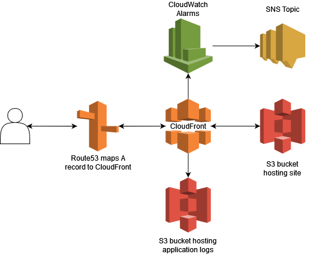

This is the code associated with [my personal website](https://joshbarbee.com). 

# Technology Stack



# Development

For local development, just `cd` into the `frontend` directory, then
```
npm install
npm run dev
```
which will use vite to serve the website locally.

# Deploying

The application is intended to be deployed on AWS. All infrastructure configuration is located in the `infra/` folder. The application requires that `terraform` is installed ahead of time. To use the included `Makefile`, it is required that `maketools` is also installed. Additionally, ensure
that you have exported your `AWS_ACCESS_KEY_ID` and `AWS_SECRET_ACCESS_KEY` environment variables. Then, run the following command:
```
make apply 

// or with no maketools

mkdir -p $(DIST_DIR) && \
cd $(FRONTEND_DIR) && \

npm install && \
npm run build && \
cd infra && \
terraform apply 
```
This will build the frontend application and deploy the infrastructure to AWS. Once deployed, the website can be accessed via the domain in 
`infra/variables.tf` under the `domain_name` variable.